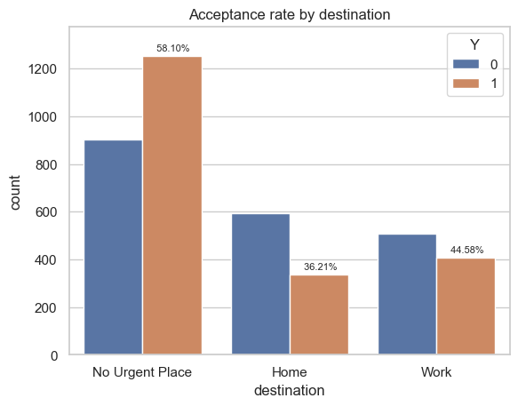
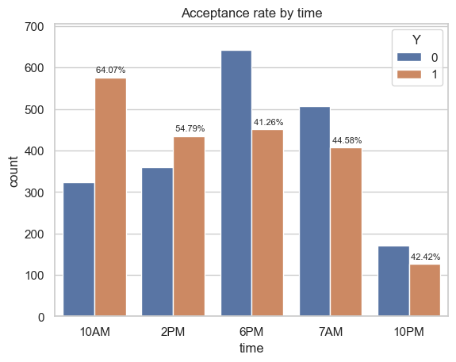
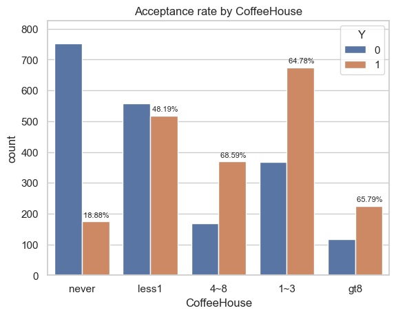
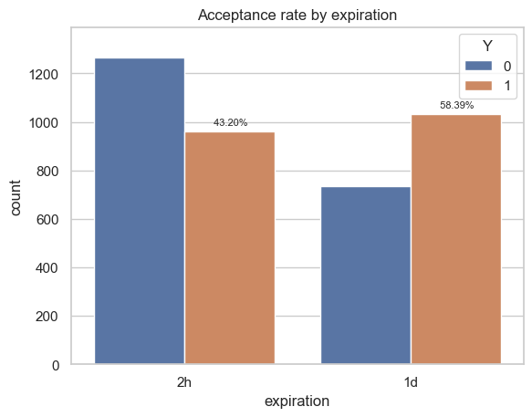
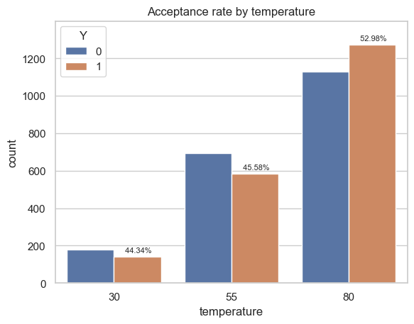

# Will the Customer Accept the Coupon?

## Context

Imagine driving through town and a coupon is delivered to your cell phone for a restaurant near where you are driving. Would you accept that coupon and take a short detour to the restaurant? Would you accept the coupon but use it on a subsequent trip? Would you ignore the coupon entirely? What if the coupon was for a bar instead of a restaurant? What about a coffee house? Would you accept a bar coupon with a minor passenger in the car? What about if it was just you and your partner in the car? Would weather impact the rate of acceptance? What about the time of day?

## Data

We are working with a dataset from the UCI Machine Learning repository that was collected via a survey on Amazon Mechanical Turk. This contains various attributes for drivers that were offered different types of coupons along with whether or not the driver accepted the coupon.

## Analysis

We performed analysis of two different coupon types to better understand the drivers that were most likely to accept these.

The two analyzed coupon types were:

- [Bar Coupons](#bar-coupons)
- [Coffee House Coupons](#coffee-house-coupons)

### Analysis Notebook

You can find the full analysis with additional details in the [Jupyter Notebook](prompt.ipynb)

## Bar Coupons

To investigate the acceptance of Bar Coupons, we looked at different breakdowns of the driver population that was offered these coupons. Overall **41.00%** of coupons were accepted.

The analysis was performed by looking at acceptance rates for different driver populations.

We broke down the population into the following categories to better understand acceptance:

1. drivers who went to a bar 3 or fewer times
1. drivers who went to a bar more than 3 timmes
1. drivers who went to a bar more than once a month **and** were over the age of 25
1. drivers who went to a bar more than once a month **and** had passengers that were not kids **and** did not work in Farming Fising & Forestry
1. drivers who went to bars more than once a month **and** had passengers that were not kids **and** were not widowed
1. drivers who went to bars more than once a month **and** are under the age of 30
1. drivers who went to cheap restaurants more than 4 times a month **and** had an income that was less than 50K
1. drivers that matched category 5 **or** category 6 **or** category 7

### Findings

Drivers who go to the bar more than once a month are generally more likely to accept bar coupons suggesting a desire to save money when they are a more frequent visitor. When we add additional constraints that are likely to put them in the category of being single or non-parents (based on passengers, marital status and age), the likelihood of them accepting bar coupons is further increased.

Drivers who earn under $50k and frequent cheap restaurants are less than 50% likely to accept bar coupons suggesting that they may also correspond to users that frequent bars less often and are thus less inclinded to accept such coupons.

## Coffee House Coupons

To investigate the acceptance of Coffee House Coupons, we examined different attributes, evaluating how they affected the acceptance of these coupons. Overall **49.92%** of coupons were accepted.

### Narrowing down attributes

We plotted acceptance rates for various categorical attributes to see if specific values yielded higher acceptance rates.

#### Destination

This shows that drivers with no urgent destination were most likely to accept a coupon, followed by drivers going to work. Only about a third of drivers headed home accepted the coupon.

#### Time of Day

We can see that drivers at 10AM and 2PM were the most likely to accept coffee coupons. Drivers at other times were only 40-45% likely to accept the coupon.

#### Coffee House Visits

We can clearly see that drivers that frequented Coffee Houses 1 or more times accepted coffee coupons about two-thirds of the time.

#### Coupon Expiration

We can see that the acceptance rate is higher in cases where the coupon as a longer expiration, suggesting that drivers are more likely to accept if they can use the coupon the following day.

#### Temperature

There is a slightly higher preference to accept coupons when the temperature is warm.

### Compound Criteria

Based on the analyses above, we partitioned data into the following two groups with these acceptance rates

1. Drivers who visit Coffee Houses more than once **and** received the coupon on a warm day
   - 71.64% accepted the coupon
1. Other drivers
   - 41.27% accepted the coupon

### Findings

Drivers who go to Coffee Houses more than once, are about 66% likely to accept Coffee House coupons. Offering these coupons on a hot day increases the acceptance rate to over 70%. Drivers that do not fall into this category (frequent vistors + warm day) are only about 40% likely to accept the coupon.

## Recommendation

To maximize the acceptance of Coffee House coupons, it would be most effective to offer them to drivers who frequently visit CoffeeHouses on days that are warm. This will also help reduce the negative sentiment experienced by drivers when they are offered coupons they are less likely to accept.

Using a similar approach for the other coupon types can help us refine when we offer these coupons to maximize user happiness, while also reducing "coupon fatigue" where they are offered coupons they are unlikely to accept.